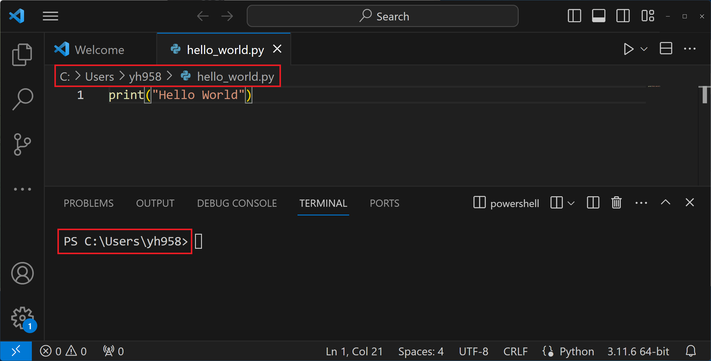

# 파이썬 기초강의 코드 모음
[Chapter 2. 변수와 데이터 타입](./chap-2/)  
[Chapter 3. 자료구조](./chap-3/)  
[Chapter 4. 흐름제어](./chap-4/)  
[Chapter 5. 함수와 모듈](./chap-5/)  
[Chapter 6. 객체지향 프로그래밍](./chap-6/)  
[Chapter 7. 알고리즘](./chap-7/)  
[Chapter 8. 정규 표현식](./chap-8/)  

# VS Code 파일 위치 확인하기
  
- 편집기 윗 부분의 경로(위 빨간 박스)가 현재 파일의 위치입니다.  
- 터미널 부분의 경로(아래 빨간 박스)가 현재 파이썬 명령의 실행 위치입니다.  
- 이 둘의 위치를 일치시켜줘야 정상적으로 실행이 됩니다.  
- 아래 명령어를 통해, 파이썬 명령 실행 위치를 변경할 수 있습니다.  
```bash
cd c:\Users\yh958
```

# 파이썬 실행
- 실습에서 명령줄을 통한 파이썬의 실행은 `python3` 또는 `python` 으로 실행됩니다.
- 실습 환경에 따라 달라질 수 있으니, 최초 설치 후 어떤 명령어로 파이썬 스크립트가 실행되는지 확인해보세요.
